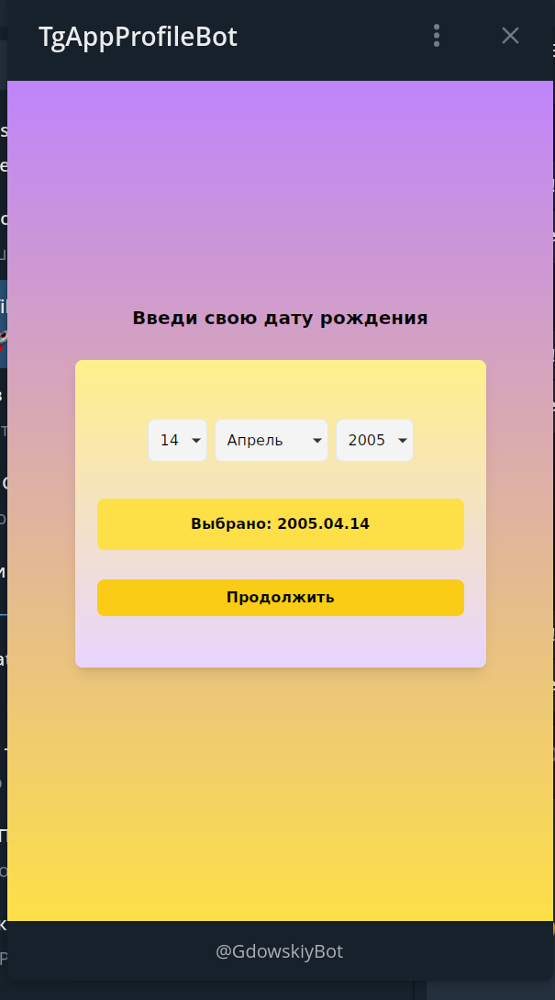

Фронт предназначен для тг miniApp но его можно оценить и в браузере

<ol>Команды в CLI для запуска:
<li>npm install</li>
<li>npm run dev</li>
<li>Переходим по хосту. e.g:(http://localhost:5174)</li>
<li>Чтобы перейти на вторуб страницу добавляем в url любой символ. e.g:(http://localhost:5174/123)/li>
</ol>
In-work screenshots:  

